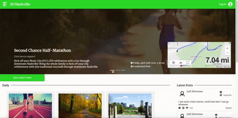

# RUNashville
>RUNashville is a place for Nashville's running community to coordinate races and share information about their personal training. The site serves four categories of users: public viewers, community members, community admins, and super admins. After a user logs in, they can view and potentially modify daily community runs and upcoming races, and check in on other community members via posts on a social feed.




## Technologies Used

  - React
  - Node
  - Express
  - MySql

## Requirements

- Node 6.13.0
- npm
- Mysql 8.0

## Development

Executing the code below will install dependencies, seed the database, start the server, and transpile the react files. Examine the package.json file for additional scripts.

```
npm install
mysql -u root -p < db/schema.sql
npm start
npm run build:dev

```

